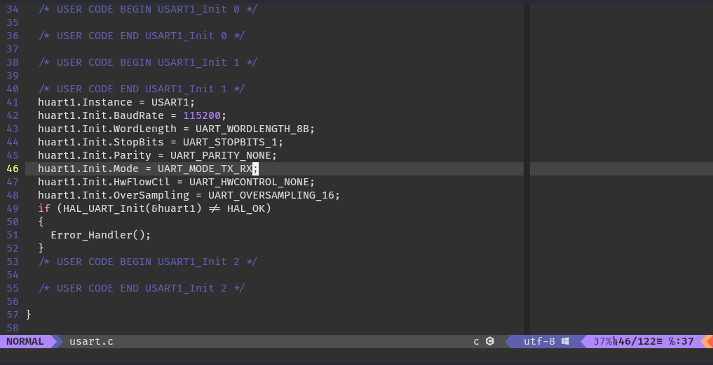

Başlangıç olarak kullanacağımız geliştirme ortamını kurmamız gerekiyor. ST firmasının bize sunduğu araçlar ile birlikte farklı firmaların da bizlere sunduğu araçlar bulunmaktadır.

Bunları listeleyecek olursak;

- STM32CubeIDE
- STM32CubeCLT
- Keil
- IAR Embedded Workbench
- ARM Mbed

## STM32CubeIDE

---

**STM32CubeIDE**, genel olarak kullanacağımız geliştirme ortamı olacaktır. STM32 mikrodenetleyicilerinin üreticisi olan STMicroelectronics firmasının resmi olarak çıkardığı bir geliştirme ortamıdır kendisi. Eskiden *Atollic TrueStudio* olarak bilinen geliştirme ortamının yeniden tasarlannıp ST firması özelinde çıkmış açık kaynaklı ve Eclipse tabanlı bir geliştirme ortamıdır.

STM32Cube ekosistemi ile bize sunulan araçlar ile geliştirme, hata ayıklama ve test işlemlerini daha hızlı bir şekilde yapabilmekteyiz. Yazılımın konfigürasyon aşamasından dağıtım aşamasına kadar kolaylaştırıcı araçları bulunmaktadır.

[STM32CubeIDE programını indirme sayfasına gitmek için tıklayabilirsin.](https://www.st.com/en/development-tools/stm32cubeide.html)

> **Not:** Yazılımı web sitelerinden indirebilmek için e-posta adresinizi kullanarak ücretsiz bir hesap oluşturmanız gerekmektedir.

## STM32CubeMX

---

STM32CubeMX programı, projenizi tasarlama aşamanızda düşük seviye donanım ayarları, çevre birimlerini ayarlama ve yapılandırma konusunda size görsel olarak destek olmaktadır.

CubeIDE geliştirme ortamı kendi içerisinde dahili olarak barındırdığı için indirmenize gerek yoktur fakat CubeIDE dışında bir geliştirme ortamı kullanacaksanız eğer CubeMX programını ayrı olarak indirmeniz gerekmektedir.

## STM32CubeProgrammer

---

Eski adıyla ST-LINK Utility programının görsel ve fonksiyonel olarak yenilenmiş hali olan STM32CubeProgrammer yazılımı, mikrodenetleyicilerinize .hex, .bin, .elf gibi uzantılı derlenmiş programlarınızı yüklemenize, flash hafızanısı sıfırlamanıza

## STLink Sürücüsü

---

bla
